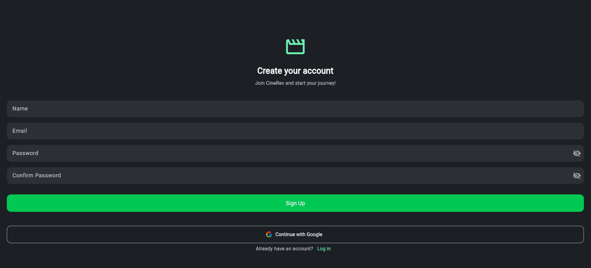
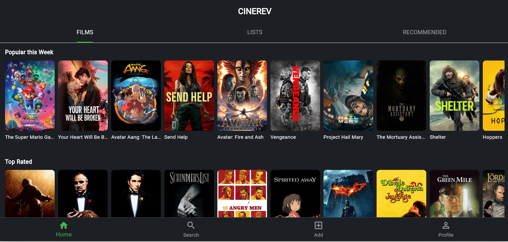
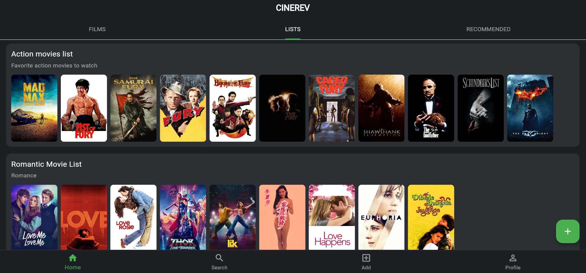
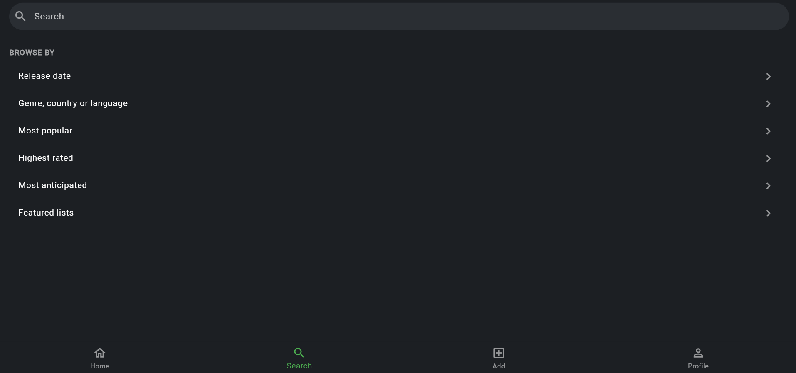
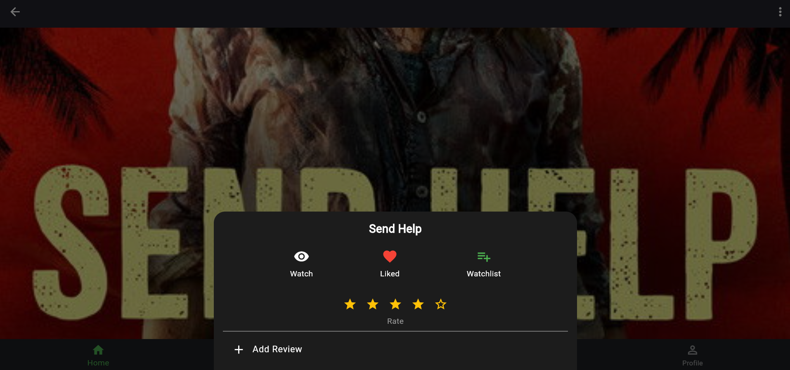
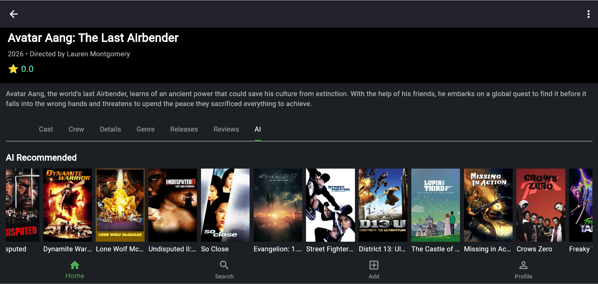
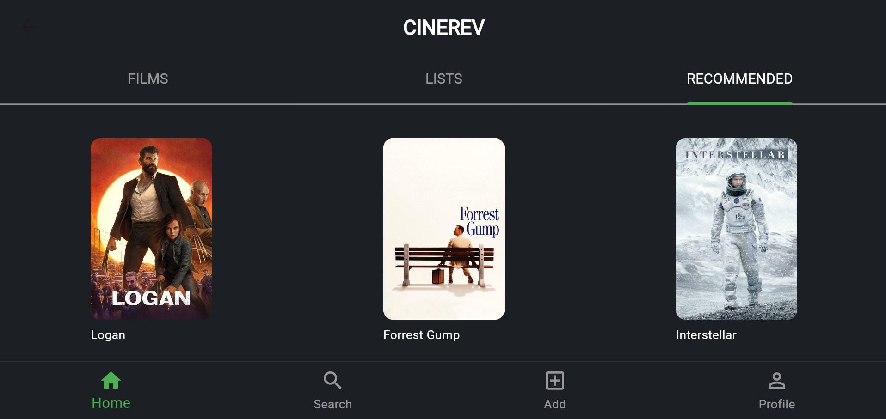

# 🎬 CiniRev - Movie Review & Recommendation App

## 📖 Description

**CiniRev** is a full-stack social platform designed for movie enthusiasts to discover, review, and discuss films in an interactive and engaging environment.

Inspired by platforms like IMDb and TMDB, it enables users to:
- Share movie experiences
- Explore films
- Get personalized recommendations
- Connect with a broader community

---

## 🚀 Features

- 🔐 User authentication & profile management  
- 🎥 Browse movies by genre, language, and country  
- ⭐ Rate and review movies  
- 📌 Create and manage watchlists  
- 🧾 Track watched movies  
- 🤖 Movie recommendation system  

---

## 🎬 Demo Video

🎥 Click below to watch the full demo:

---

## 📸 Screenshots

### 📝 Signup Page

### 🏠 Home Page

### 🎬 Movie Listing

### 🔍 Search & Filter

### ⭐ Review & Rating

### 🤖 AI Recommendation

### 📊 Recommendation System

---

## 🧠 Recommendation System

CiniRev uses the **Apriori Algorithm** to generate personalized movie recommendations.

- 📊 Finds frequently watched movie patterns  
- 🎯 Suggests movies based on user behavior  
- 📈 Improves recommendation accuracy over time  

---

## 🛠 Tech Stack

### 🎨 Frontend
- Flutter (Cross-platform UI)

### ⚙️ Backend
- FastAPI (Python)

### 🗄 Database
- PostgreSQL

### 🔗 APIs Used
- TMDB API (Movie data)
- Gemini API 

---

## ⚡ Project Highlights

- ✅ Modular backend architecture using FastAPI  
- ✅ Real-time API integration with TMDB  
- ✅ Recommendation system using Apriori algorithm  
- ✅ Clean and responsive Flutter UI  
- ✅ Scalable and maintainable project structure  

---

## 📂 Project Structure (Simplified)
